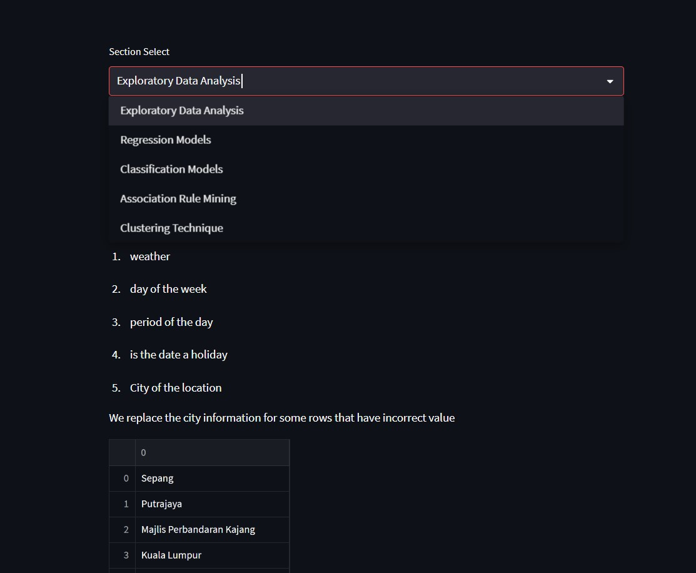

# Data Mining Project

This python streamlit project is created for Multimedia University data mining project



## **Features**

- Interactive streamlit application to perform data analysis and visualization of data
- Contains exploratory data analysis, regression model result, classification model result, association rule mining, clustering techniques

## **Getting Started**

```
HTTPS - git clone https://github.com/ChaoticHG/Streamlit-Python-Data-Analysis-Dashboard.git

SSH - git clone git@github.com:ChaoticHG/Streamlit-Python-Data-Analysis-Dashboard.git

cd Streamlit-Python-Data-Analysis-Dashboard/

create python environment with python -m venv myenv

activate the environment with .\myenv\Scripts\activate

pip install -r requirements.txt

streamlit run app.py
```

## **Build with **

- streamlit
